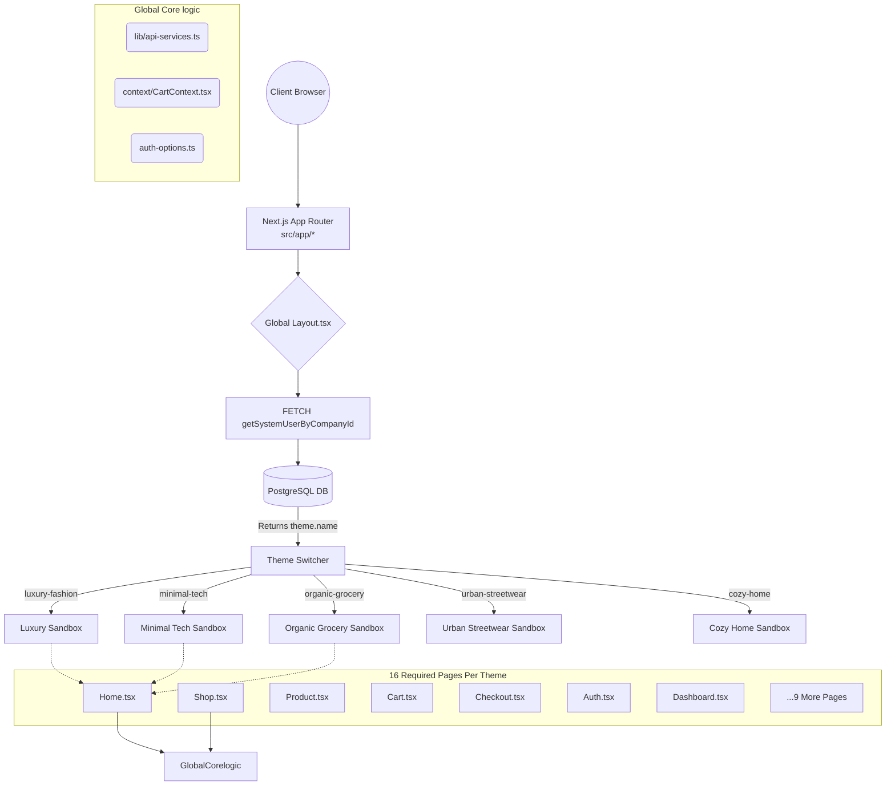
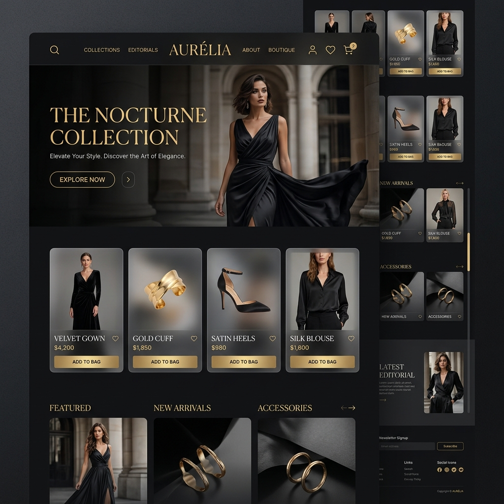
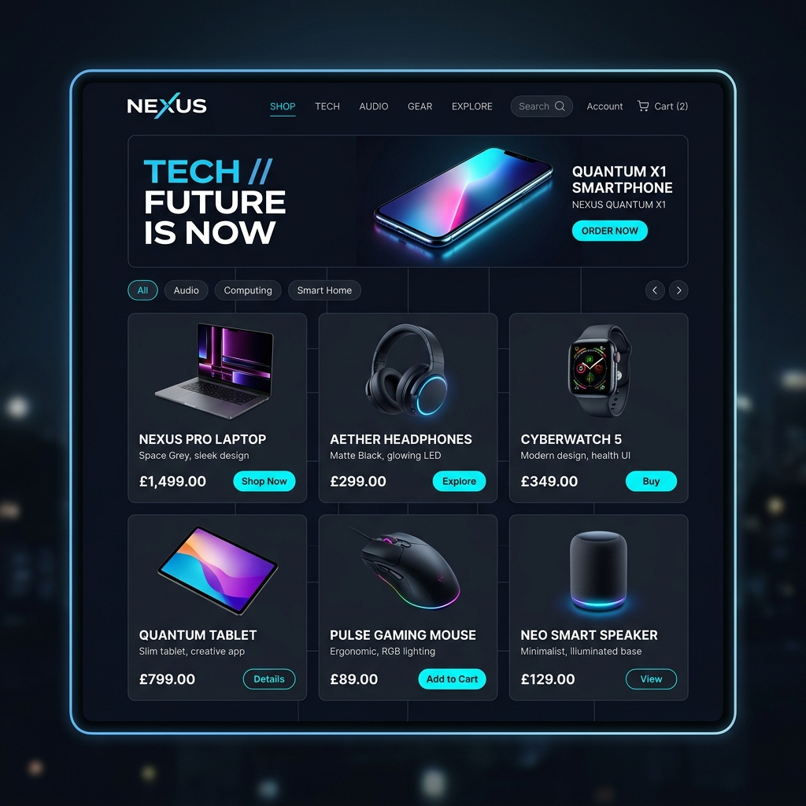
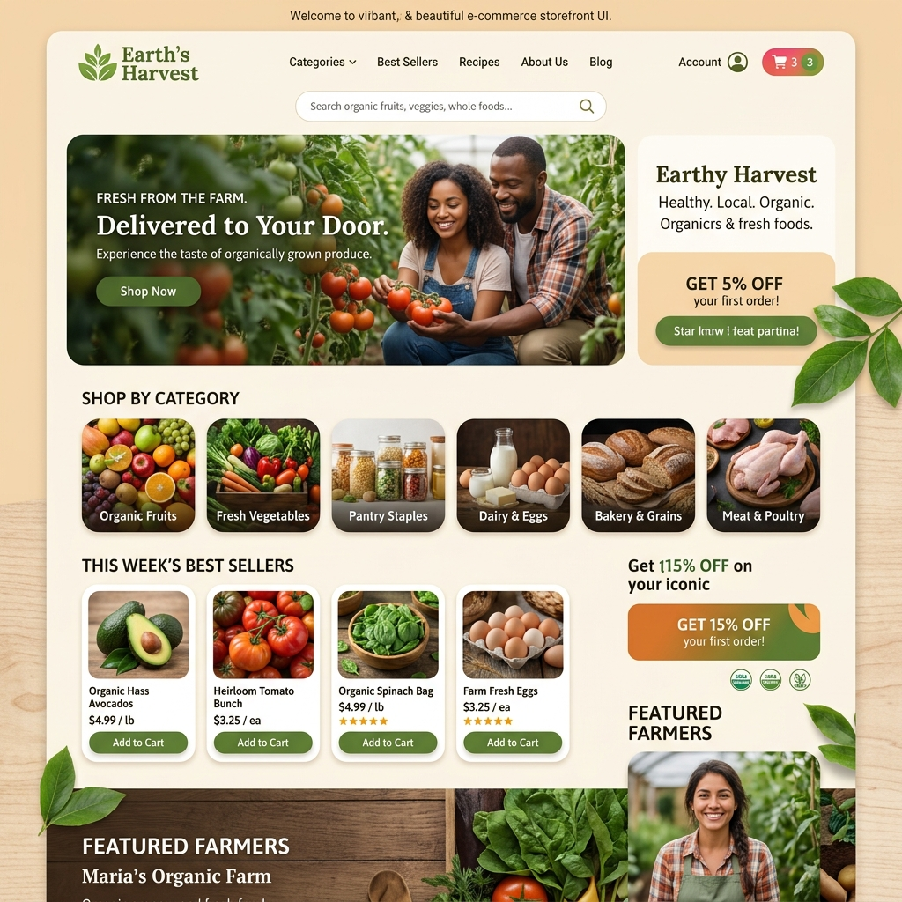
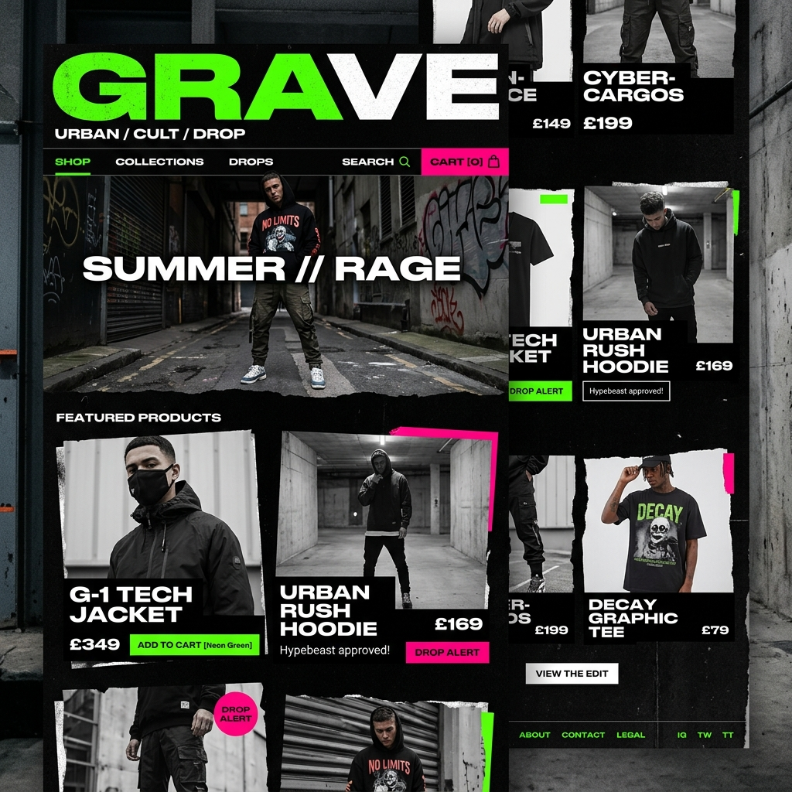
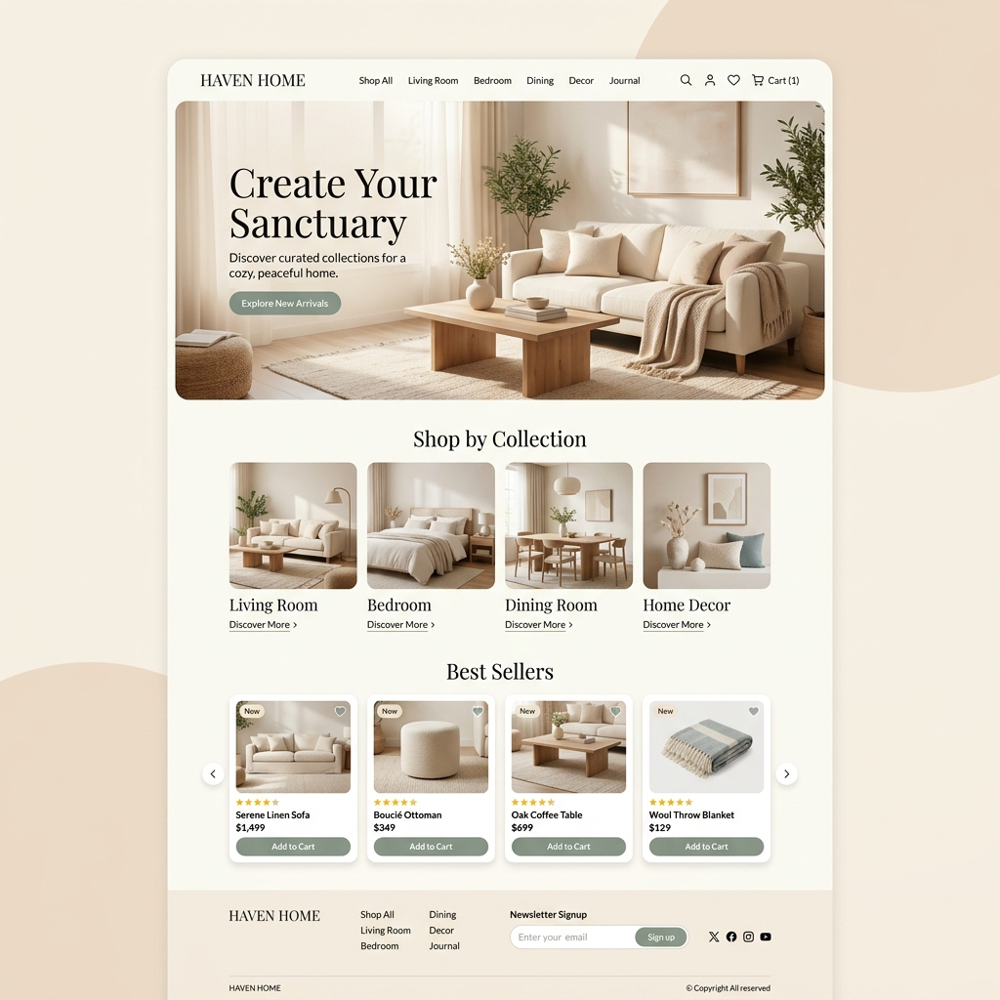
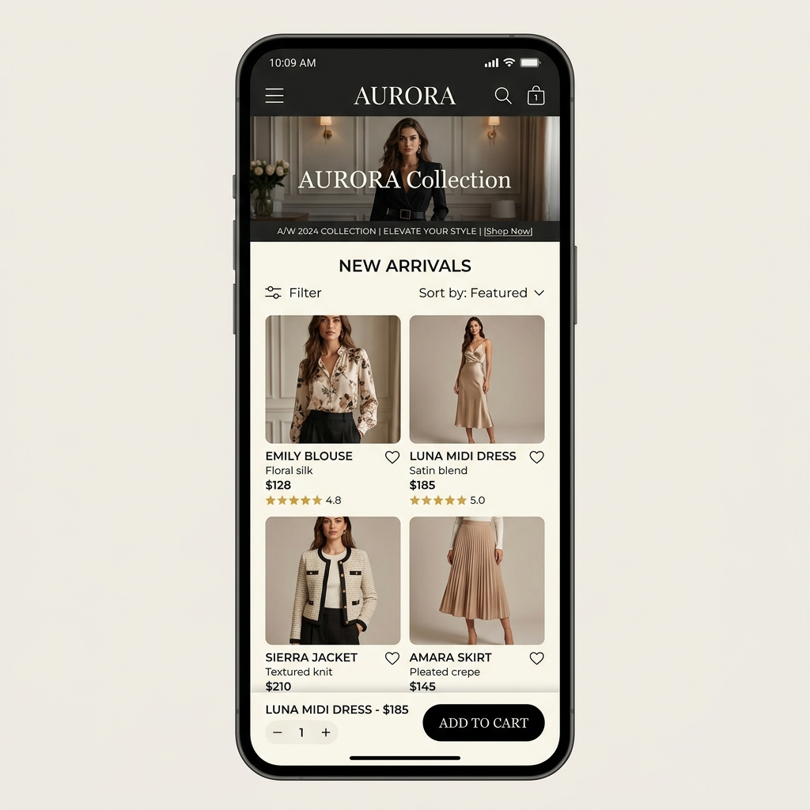
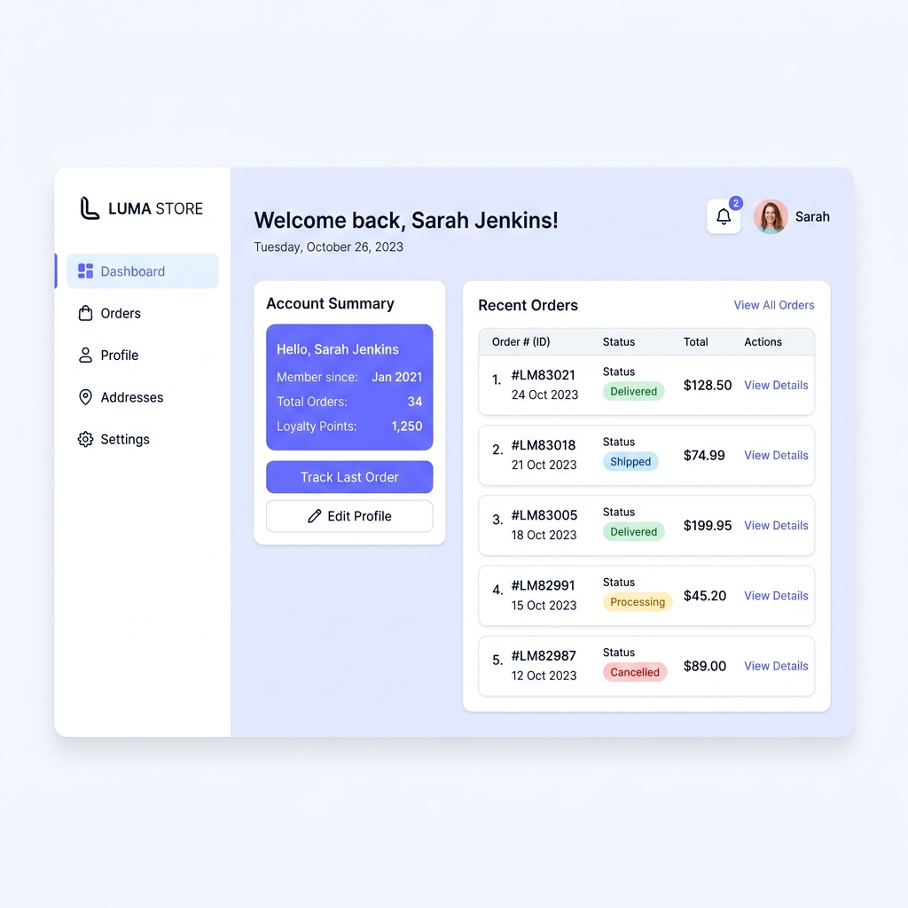

# Squadcart Multi-Theme Engine & Architecture

Welcome to the Squadcart Theme Engine!

Since `squadcart-themes` is a Single Multi-Tenant Next.js Codebase, all clients share this exact repository. However, clients can purchase and switch between different templates (Themes) from their Admin Console. We achieve this by fetching their active `theme.id` from the backend API, and dynamically rendering the matching component hierarchy.

## 🏗️ System Architecture & Data Flow

The platform utilizes a dynamic, data-driven Theme Engine. The incoming request domain maps to a specific `companyId`, which fetches the tenant's exact configuration and active `themeId` from the PostgreSQL backend. The Next.js App Router then dynamically defers rendering to the appropriate Theme Sandbox.



## 📂 Directory Structure & Required Pages

To prevent global CSS bloat and dependency collisions, all 16 required views reside safely inside their individual theme folders. Every newly created theme MUST contain this exact 16-page responsive structure to maintain feature parity.

```text
src/themes/
├── [theme-name]/
│   ├── components/  (Isolated Navbar, Footer, Buttons, Cards)
│   ├── styles/      (Theme-specific CSS modules/overrides)
│   ├── pages/      
│   │   ├── Home.tsx            (Landing Page)
│   │   ├── Shop.tsx            (Shop / Category Page)
│   │   ├── Product.tsx         (Product Details)
│   │   ├── Cart.tsx            (Shopping Cart)
│   │   ├── Checkout.tsx        (Checkout Gateway)
│   │   ├── Auth.tsx            (Login / Register Split View)
│   │   ├── Dashboard.tsx       (User Dashboard / Profile)
│   │   ├── Wishlist.tsx        (Wishlist)
│   │   ├── OrderConfirm.tsx    (Order Confirmation / Receipt)
│   │   ├── Search.tsx          (Search Results List)
│   │   ├── Contact.tsx         (Contact Us)
│   │   ├── About.tsx           (About Us)
│   │   ├── Privacy.tsx         (Privacy Policy)
│   │   ├── Terms.tsx           (Terms & Conditions)
│   │   ├── Refund.tsx          (Refund / Return Policy)
│   │   └── NotFound.tsx        (Custom 404 Page)
```

## 🛠️ How to Add a New Theme

**Step 1: Create the Theme Directory**
Copy an existing template or make a new 16-page folder inside `src/themes/my-custom-theme/`.

**Step 2: Build Your Theme's Page UI**
Instead of directly editing `src/app/page.tsx` (the Next.js router), you build a specialized view inside your theme folder that fulfills the layout requirement.

**Step 3: Register the Theme to the Main App Router**
Once your UI is ready, conditionally map it in the corresponding Next.js routes based on the `theme.name` fetched from the `getSystemUserByCompanyId` API.

**Step 4: Create the Database Record**
For the Admin Console to show this new theme, it must exist in the PostgreSQL Database. Insert a new row inside the `Theme` table in `squadcart-backend`.

## ⚠️ Important Rules for Developers (Component Sandboxing)

1. **No Mixed UI Libraries:** If `minimal-tech` uses Framer Motion for heavy animations, the import stays strictly inside `src/themes/minimal-tech`.
2. **Tailwind Config:** Tailwind utility classes are safe, but monolithic custom CSS overrides must be scoped per theme using CSS Modules to prevent global styling conflict.
3. **Reuse Global Libs:** Use the existing `src/lib/api-services.ts` and `CartContext` universally to prevent rewriting logic.
4. **No Direct Routing!** All new files in Next.js `App Router` (`src/app/`) MUST be generic wrappers that defer to the active theme. Never write `<div className="my-cool-theme">` inside `src/app/checkout/page.tsx`.

## 🖼️ Theme Previews & Mockups

UI designs, mockups, and preview screenshots for the core themes (`luxury-fashion`, `minimal-tech`, `organic-grocery`, `urban-streetwear`, `cozy-home`) along with their internal layouts (Checkout, Product views, Dashboards, Mobile Views) are permanently stored in the `public/theme-previews/` directory. 

Future developers MUST review these images to understand the target aesthetic before working on the respective theme's Next.js components.

### 1. Luxury Fashion View


### 2. Minimal Tech View


### 3. Organic Grocery View


### 4. Urban Streetwear View


### 5. Cozy Home View


### Mobile & Dashboard (All Themes)


